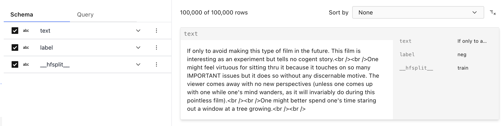
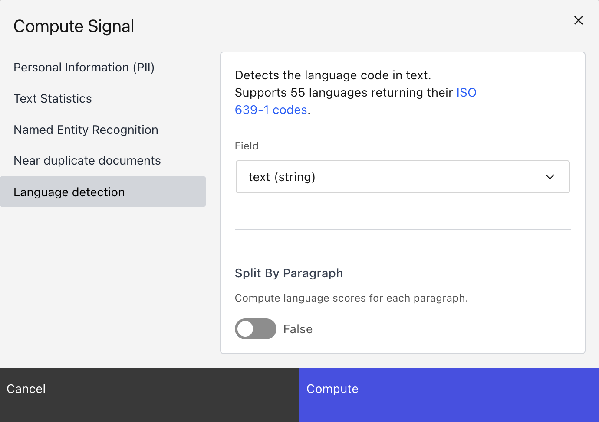

<h1 align="center">🌸 Lilac</h1>
<p align="center">
  <a style="padding: 4px;"  href="https://lilacai-lilac.hf.space/">
    <span style="margin-right: 4px; font-size: 12px">🔗</span> <span style="font-size: 16px">Try the Lilac web demo!</span>
  </a>
  <br/><br/>
  <a href="https://lilacml.com/">
        
    </a>
    <a href="https://dcbadge.vercel.app/api/server/jNzw9mC8pp?compact=true&style=flat">
        
    </a>
    <a href="https://github.com/lilacai/lilac/blob/main/LICENSE">
          
    </a>
    <br/>
    <a href="https://github.com/lilacai/lilac">
      
    </a>
    <a href="https://twitter.com/lilac_ai">
      
    </a>
</p>

## 👋 Welcome

[Lilac](http://lilacml.com) is an open-source product that uses AI to help you **curate better
data** for LLMs, from RAGs to fine-tuning datasets.

Lilac runs **on-device** using open-source LLMs and combines an interactive UI and a Python API for:

- **Exploring** datasets with natural language (documents)
- **Annotating & structuring** data (e.g. PII detection, profanity, text statistics)
- **Semantic search** to find similar results to a query
- **Conceptual search** to find and tag results that match a fuzzy concept (e.g. low command of
  English language)
- **Clustering** data semantically for understanding & deduplication
- **Labeling** and **Bulk Labeling** to curate data

https://github.com/lilacai/lilac/assets/2294279/cb1378f8-92c1-4f2a-9524-ce5ddd8e0c53

## 🔥 Getting started

### 💻 Install

```sh
pip install lilac
```

If you prefer no local installation, you can fork the
[fork the HuggingFace Spaces demo](https://lilacai-lilac.hf.space/). Documentation
[here](https://lilacml.com/huggingface/huggingface_spaces.html).

### 🔥 Start a server

Start a Lilac webserver from the CLI:

```sh
lilac start ~/my_project
```

Or start the Lilac webserver from Python:

```py
import lilac as ll

ll.start_server(project_dir='~/my_project')
```

This will open start a webserver at http://localhost:5432/ where you can now load datasets and
explore them.

### 📊 Load a dataset

Datasets can be loaded directly from HuggingFace, CSV, JSON,
[LangSmith from LangChain](https://www.langchain.com/langsmith), SQLite,
[LLamaHub](https://llamahub.ai/), Pandas, Parquet, and more. More documentation
[here](https://lilacml.com/datasets/dataset_load.html).

```python
import lilac as ll

ll.set_project_dir('~/my_project')

config = ll.DatasetConfig(
  namespace='local',
  name='imdb',
  source=ll.HuggingFaceSource(dataset_name='imdb'))

dataset = ll.create_dataset(config)
```

If you prefer, you can load datasets directly from the UI without writing any Python:


### 🔎 Exploring

Once we've loaded a dataset, we can explore it from the UI and get a sense for what's in the data.
More documentation [here](https://lilacml.com/datasets/dataset_explore.html).



### ⚡ Annotate with Signals (PII, Text Statistics, Language Detection, Neardup, etc)

```python
import lilac as ll

ll.set_project_dir('~/my_project')

dataset = ll.get_dataset('local', 'imdb')

# [Language detection] Detect the language of each document.
dataset.compute_signal(ll.LangDetectionSignal(), 'text')

# [PII] Find emails, phone numbers, ip addresses, and secrets.
dataset.compute_signal(ll.PIISignal(), 'text')

# [Text Statistics] Compute readability scores, number of chars, TTR, non-ascii chars, etc.
dataset.compute_signal(ll.PIISignal(), 'text')

# [Near Duplicates] Computes clusters based on minhash LSH.
dataset.compute_signal(ll.NearDuplicateSignal(), 'text')

# Print the resulting manifest, with the new field added.
print(dataset.manifest())
```

We can also compute signals from the UI:



### 🔎 Searching data

#### Semantic search

In the UI, we can search by semantic similarity or by classic keyword search


## 💬 Contact

For bugs and feature requests, please
[file an issue on GitHub](https://github.com/lilacai/lilac/issues).

For general questions, please [visit our Discord](https://discord.com/invite/jNzw9mC8pp).
