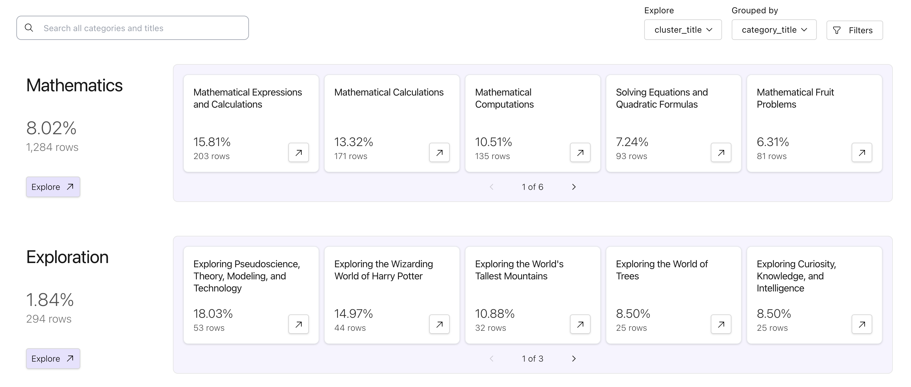

# Cluster a dataset

Clustering can reveal the overarching structure of your dataset by automatically assigning
categories to each document. Lilac uses state of the art algorithms and LLMs to cluster the dataset
and assign informative, descriptive titles. Our clustering produces 2 levels of clusters:

- A coarse category, which is a high level group of examples
- A detailed cluster, which is a granular group of examples

Lilac makes clusters immediately actionable. You can tag, or simply delete entire clusters from your
dataset, enabling you to remove problematic data with precision. You can also take these clusters
and use them to train a [Concept](../concepts/concepts.md), which is a way of pinning a cluster and
detecting in-cluster examples across time and different datasets. This is a great way to ensure that
you can continue to detect, track, and address these data points in the future.

## From the UI

To cluster a text field, open the schema view, click the expand icon for the field you want to
cluster and select "Compute clusters".


Clustering is an expensive operation. To dramatically speed up the computation, join the
[Lilac waitlist](https://forms.gle/Gz9cpeKJccNar5Lq8) to get access to
[Lilac Garden](https://lilacml.com/garden), our platform for accelerated data processing. Lilac
Garden uses powerful GPUs to embed, cluster and annotate one million documents in about 20-30 mins.
Once you have access to Lilac Garden, you can select the "Use Lilac Garden" option to accelerate
clustering.


When the clustering is complete, you can view the cluster results in the UI, by clicking on the
"Open clusters" button in the header, next to the "Open schema" button.


This will open the Cluster view, which shows high level categories and their detailed clusters. From
this view you can open a cluster to see the examples in it, and take actions on the cluster.



## From Python

You can cluster a dataset from Python in 1 line of code:

```python
dataset.cluster(input='conversation.*.input', use_garden=True)
```

Arguments:

- `input` can be a field path or a function that takes an example and returns a text content.
- `output_path`, optional. Defaults to the input path suffixed with `__cluster`.
- `use_garden`, optional. Defaults to `False`. If `True`, Lilac Garden will be used to accelerate
  clustering.
- `min_cluster_size`, optional. Defaults to 5. This is the minimum number of examples in a cluster.
  Clusters with fewer examples will be merged into the nearest cluster.
- `topic_fn`: optional. Function that returns a topic summary for each cluster. It takes a list of
  `(text, membership_score)` tuples and returns a single topic. This is used to compute the topic
  for a given cluster of docs. It defaults to a function that summarizes the common topic across
  several examples from the cluster.

When the clustering is complete, you can view the cluster results in the UI (see previous section).
