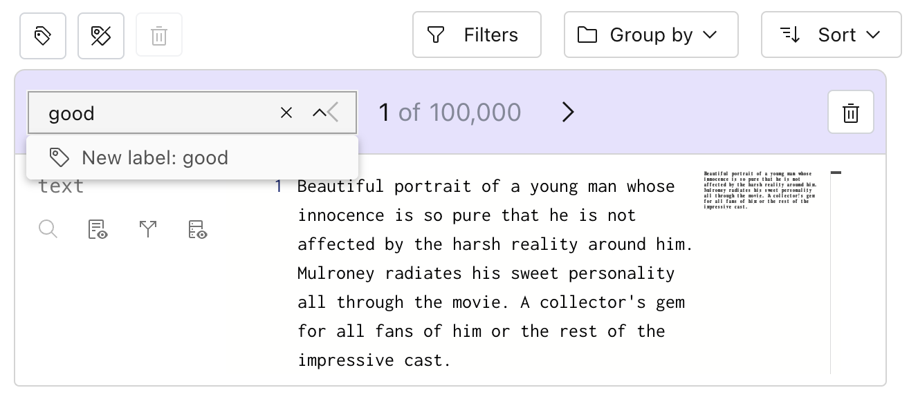
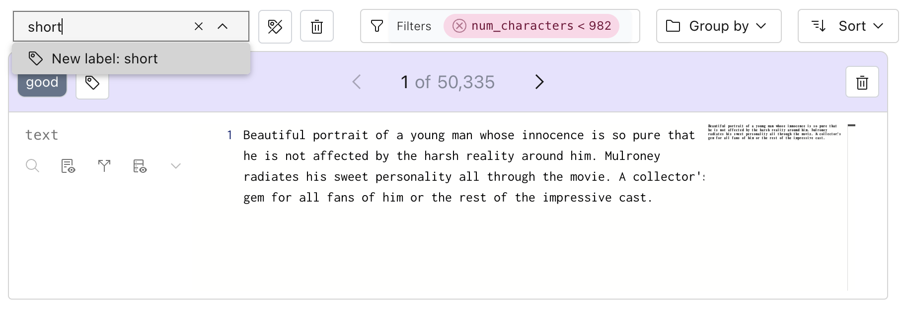

# Labeling a dataset

Lilac allows you to tag individual rows with custom labels that can be later used to prune your
dataset.

## From the UI

### Label individual rows

Once we've loaded a dataset, each row will have a "+" button where you can add labels. Labels are
currently just tags - a row has it, or does not have it.

</img>

This will open up a dialog that lets us create a new tag:

</img>

Once committing the tag, we can see that the row has a new label:

</img>

### Label multiple rows

Labeling individual rows can be time-consuming, so Lilac provides a "Label all" feature, which
allows you label all rows within a given filter.

Let's label rows that have relatively short text. First, open the schema, click on "num_characters"
and click on the first histogram:

</img>

We can see that we're in the cut of the dataset with 50,335 rows, about half of our dataset.

</img>

Now, we can click "Label all", attach a label, and all 50,335 rows will be labeled.

</img>

Once we click the label, the results in view will have that label:

</img>

### Filtering rows with the label

To find all rows with a given label, we can use the search box to filter by the label.
</img>

We can click on the tag pill at any point to apply a filter to show all the labels:

</img>

### Exporting labels

Just like for any other field, we can export labels with the dataset by clicking the "Download" icon
in the top right.
