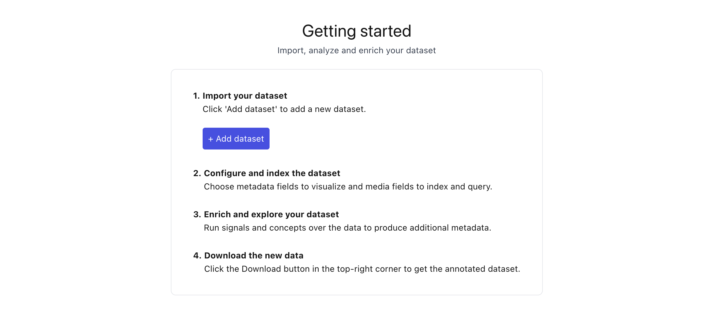
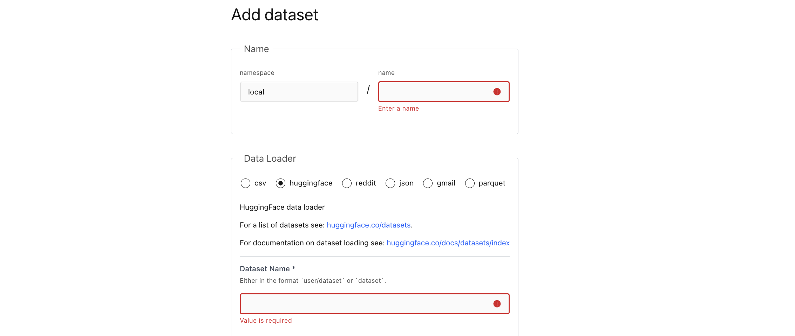
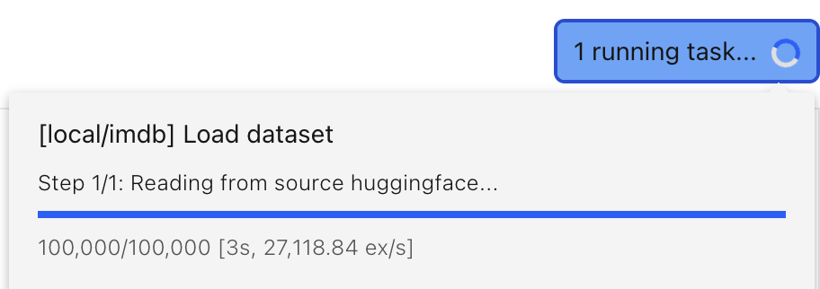

# Load a dataset

```{tip}
[Explore popular datasets in Lilac on HuggingFace](https://lilacai-lilac.hf.space/)
```

Loading a dataset can be done from the UI or from Python. See [](#lilac.sources) for details on
available sources.

## From the UI

### Start the webserver

To start the webserver at a lilac project directory:

```sh
lilac start ~/my_project
```

This will start an empty lilac project under `~/my_project`, with an empty `lilac.yml` and start the
webserver. The configuration for `lilac.yml` can be found at [](#Config). The `lilac.yml` file will
stay up to date with interactions from the UI. This can be manually edited, or just changed via the
UI. For more information on peojcts, see [Projects](../projects/projects.md).

### Load a dataset

To load a dataset from the UI, click the "Add dataset" button from the "Getting Started" homepage.

</img>

This will open the dataset loader UI:

</img>

##### Step 1: Name your dataset

- `namespace`: The dataset namespace group. This is useful for organizing dataset into categories,
  or organizations.
- `name`: The name of the dataset within the namespace.

##### Step 2: Chose a source (data loader)

- [`csv`](#lilac.sources.CSVSource): Load from CSV files.
- [`huggingface`](#lilac.sources.HuggingFaceSource): Load from a HuggingFace dataset.
- [`json`](#lilac.sources.JSONSource): Load JSON or JSONL files.
- [`gmail`](#lilac.sources.GmailSource): Load your emails from gmail. No data is sent to an external
  server, unless you use a remote embedding. See [Embeddings](../embeddings/embeddings.md) on
  chosing an embedding.
- [`parquet`](#lilac.sources.ParquetSource): Load from parquet files.

More details on the available data loaders can be found in [](#lilac.sources).

Don't see a data loader? File a bug, or send a PR to
[https://github.com/lilacai/lilac](https://github.com/lilacai/lilac)!

##### Step 3: Load your data!

After you click "Add", a task will be created:

</img>

You will be redirected to the dataset view once your data is loaded.

## From Python

### Creating a dataset

You can create a dataset from Python using [](#lilac.create_dataset). Lilac supports variety of data
sources, including CSV, JSON, HuggingFace datasets, Parquet, Pandas and more. See [](#lilac.sources)
for details on available sources.

Before we load any dataset, we should set the project directory which will be used to store all the
datasets we import. If not set, it defaults to the current working directory.

```python
import lilac as ll
ll.set_project_dir('~/my_project')
```

#### Huggingface

This example loads the `glue` dataset with the `ax` config from HuggingFace:

```python
config = ll.DatasetConfig(
  namespace='local',
  name='glue',
  source=ll.HuggingFaceSource(dataset_name='glue', config_name='ax'))
# NOTE: You can pass a `project_dir` to `create_dataset` as the second argument.
dataset = ll.create_dataset(config)
```

#### CSV

```python
url = 'https://storage.googleapis.com/lilac-data/datasets/the_movies_dataset/the_movies_dataset.csv'
config = ll.DatasetConfig(
  namespace='local', name='the_movies_dataset', source=ll.CSVSource(filepaths=[url]))
dataset = ll.create_dataset(config)
```

#### Parquet

The parquet reader can read from local files, S3 or GCS. If your dataset is sharded, you can use a
glob pattern to load multiple files.

**Sampling**

The `sample_size` and `shuffle_before_sampling` arguments are optional. When
`shuffle_before_sampling` is `True`, the reader will shuffle the entire dataset before sampling, but
this requires fetching the entire dataset. If your dataset is massive and you only want to load the
first `sample_size` rows, set `shuffle_before_sampling` to `False`. When you have many shards and
`shuffle_before_sampling` is `False`, the reader will try to sample a few rows from each shard, to
avoid any shard skew.

```python
source = ll.ParquetSource(
  filepaths=['s3://lilac-public-data/test-*.parquet'],
  sample_size=100,
  shuffle_before_sampling=False)
config = ll.DatasetConfig(namespace='local', name='parquet-test', source=source)
dataset = ll.create_dataset(config)
```

#### JSON

The JSON reader can read from local files, S3 or GCS. If your dataset is sharded, you can use a glob
pattern to load multiple files. The reader supports both JSON and JSONL files.

```python
config = ll.DatasetConfig(
  namespace='local',
  name='news_headlines',
  source=ll.JSONSource(filepaths=[
    'https://raw.githubusercontent.com/explosion/prodigy-recipes/master/example-datasets/news_headlines.jsonl'
  ]))
dataset = ll.create_dataset(config)
```

#### Pandas

```python
url = 'https://storage.googleapis.com/lilac-data-us-east1/datasets/csv_datasets/the_movies_dataset/the_movies_dataset.csv'
df = pd.read_csv(url, low_memory=False)
config = ll.DatasetConfig(namespace='local', name='the_movies_dataset2', source=ll.PandasSource(df))
dataset = ll.create_dataset(config)
```

For details on all the source loaders, see [](#lilac.sources). For details on the dataset config,
see [](#lilac.DatasetConfig).

### Loading from lilac.yml

When you start a webserver, Lilac will automatically create a project for you in the given project
path, with an empty `lilac.yml` file in the root of the project directory. See
[Projects](../projects/projects.md) for more information.

```python
import lilac as ll

ll.start_server(project_dir='~/my_lilac')
```

This will create a project file:

```sh
~/my_lilac/lilac.yml
```

The configuration for `lilac.yml` can be found at [](#Config). The `lilac.yml` file will stay up to
date with commands from python, however this file can also be manually edited.

The next time the web server boots up, the `lilac.yml` file will be read and loaded. Tasks will be
visible from the UI.

Alternatively, you can explicitly load the lilac.yml after editing it without starting the
webserver:

```python
ll.load(project_dir='~/my_lilac')
```

Or from the CLI:

```sh
lilac load --project_dir=~/my_lilac
```
